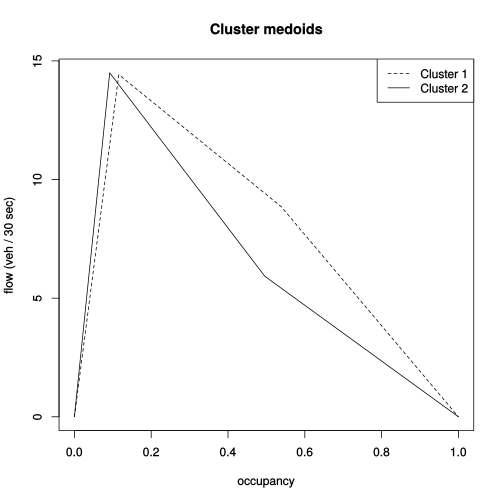

# PEMS stations fundamental diagrams

Clark Fitzgerald (Statistics), Professor Michael Zhang (Civil Engineering)

UC Davis

Nov 2017

This is a brief set of working notes for a project analyzing highway
traffic sensor data. 

This map shows traffic sensors colored based on the shape of their
fundamental diagram. Zoom and click the points for more information.

The capacity is the highest point on the fundamental diagram, the point
where the left and mid lines meet. It's in units of vehicles per hour.

## Fundamental Diagrams

The image below shows the medoid (average) shapes of the clusters. A few
notes:

- Steeper slopes on the right hand side mean that traffic clears out faster
- The green line is concave while the orange one is not.
- Some regions are mostly orange, such as I 680 around San Ramon
- Other regions are mixed, such as the Bay Bridge connecting San
  Francisco and Oakland

## Clustering

I used a kernel based method to cluster the stations. The kernel is based
on the [inner product between
functions](https://en.wikipedia.org/wiki/Dot_product#Functions) over the
interval (0, 1).

## Computation

Computation currently consists of the following steps:

- Download 10 months of 30 second sensor data for the Bay Area from the
[CalTrans Performance Measurement System](http://pems.dot.ca.gov/) (PEMS)
into Hadoop
- Use [Hive with R](http://clarkfitzg.github.io/2017/10/31/3-billion-rows-with-R/) to group data by station and fit the fundamental diagrams for each station
- Compute the kernel matrix between all fundamental diagrams using
  numerical integration (just for fun, it also has an analytic form)

Thu Nov 30 14:24:25 PST 2017

Beginning to write paper now.

## Computational Techniques

The size and structure of the data presented a challenge; this is why we
wanted to work with it. 

We first downloaded 10 months from January 2016 - October 2016 of 30 second sensor data from the
[CalTrans Performance Measurement System](http://pems.dot.ca.gov/) (PEMS)
http://pems.dot.ca.gov/ website onto a local server. I chose to only
download those files from the San Francisco Bay Area (CalTrans district 3)
because there is a large amount of data there, and we'm somewhat familiar
with the roads.

Each file represents one day of observations. There are around 10 million
rows and 26 columns per file that take up about 90 - 100 MB each when
compressed on disk. Represented in memory as double precision floating point numbers
each file will occupy about 2 GB of memory. This size becomes unwieldy with most
programming languages. I processed 284 files total, which will take up 500+
GB if completely loaded into memory. This size motivated some new
computational techniques.

Hive provided the crucial piece of infrastructure to process this data.
Using schema on read with external files in Hadoop File System (HDFS)
meant that all we had to do to load the data was copy the files to HDFS, so
the load took less than 5 minutes.

We used Hive's `CLUSTER BY` to separate the data into different stations
before analyzing the fundamental diagram for each station. Each station had
around 800 million observations corresponding to one every 30 seconds for
10 months. We processed results in a streaming Map Reduce using the R
language to express the analytic operations.

When we did this we weren't aware of the `RHive` package, which hasn't been
actively maintained since 2015. Our computational model has less
sophisticated interactive features, but is much more efficient for batch
processing based on large groups, because groups are loaded in an operated
on at a million elements at a time rather than line by line. An experiment
showed that line by line processing would slow the program down by a factor
of several hundred. Then we would be measuring run times in days rather
than in minutes.

## Data Analysis

We fit the fundamental diagram modeling vehicle flow per 30 seconds as a
function of sensor occupancy. We used three different increasingly complex
piecewise linear functions.

The first method used robust regression to fit curves on the left and right
hand sides of a cutoff where occupancy = 0.2. We initially chose robust
regression because of its resistance to outliers. These models included an
intercept, so each station is represented by two linear models, which
becomes 4 floating point numbers. Including the intercept means that the
fundamental diagram doesn't necessarily pass through the points (0, 0) and
(1, 0). In the areas of high density many didn't pass through (1, 0).

The second method fit three separate lines from points in different
regions:

- Left line comes from fitting in (0, 0.1)
- Center line comes from fitting in (0.2, 0.5)
- Right line comes from fitting in (0.5, 1)

We fit the lines using least squares subject to the constraints that the
fundamental diagram must pass through (0, 0) and (1, 0).
Enforcing this constraints makes for a more reasonable model, since we know
that the fundamental diagram must satisfy this.
We ignored the points in the region (0.1, 0.2) because points vary widely
in this region as the traffic transitions to a congested state.

The last method used a nonparametric method based on binning the data based
on the values of the occupancy and then computing means for the flow in
each bin. We started out with a fixed minimum bin width of `w = 0.01`,
which means that there will be no more than `1 / w = 100` bins in total.
We chose 0.01 because it provides sufficient resolution for the fundamental
diagram in areas of low density. Furthermore, we required that each bin
has at least `k` observations in each bin. Some experimentation for a few
different stations showed that choosing `k = 200` provided a visually
smooth fundamental diagram. 

TODO: Is there any theoretical statistical justification for this
technique? It's somewhat a data summary technqiue. How much information
is preserved?

Because there are more observations in areas of low occupancy we have more
bins here. To construct the piecewise linear fundamental diagram we then
simply define lines connecting each mean. This minimizes the assumptions we
need to make about the fundamental diagram. Indeed, this derived data could
be used for further analysis of empirical traffic flow.

Fitting the data produces a fundamental diagram for each station. However,
we removed stations that satisfied any of the following conditions:
- all observations in one bin are the same. This probably comes from a
  sensor error.
- all observations had mean flow less than 1 vehicle per 30 seconds. If
  occupancy is nonzero and flow is always less than 1 then this means flow
  isn't being properly counted.
- there are few observations in the area of high density. We experimented a
  bit and found a reasonable filter to be fewer than 10 bins in an area of
  occupancy greater than 0.2. These may be real phenomena in the data
rather than sensor errors; it simply means that very little congestion
(high occupancy) events happened at that station during the time of
analysis.

All this filtering brought the number of stations down from 3722 to 1379,
so about 37 percent of the data 
